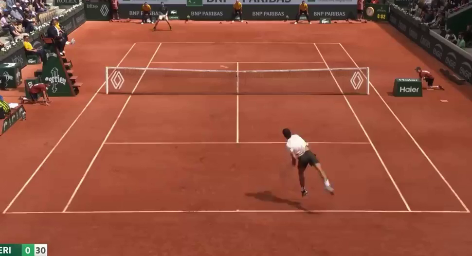
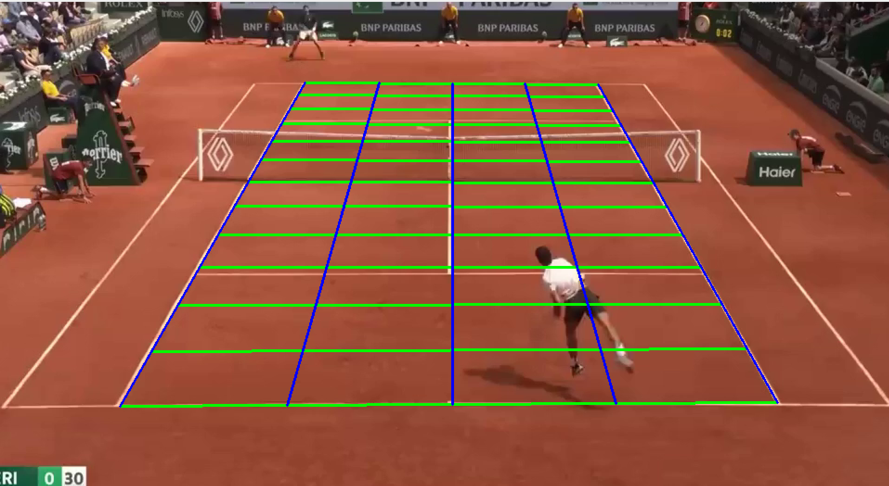
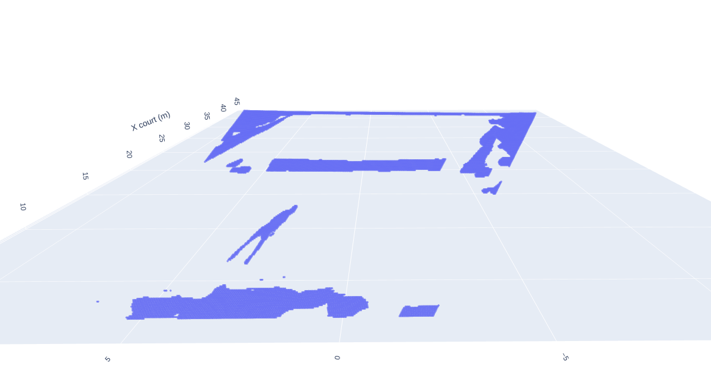
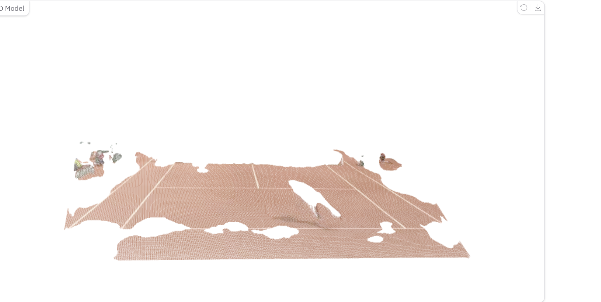

VGGT_TASK
---

# Tennis Pointcloud Estimation

## 📦 Установка

1. **Клонируем VGGT и устанавливаем зависимости:**

```bash
git clone https://github.com/facebookresearch/vggt
cd vggt
pip install -r requirements.txt
```

2. **Скачиваем веса модели:**

Вес модели `vggt-1b.pt` можно взять из Hugging Face или установить локально.
Я скачал и сохранил вес на сервере вручную:

```
vggt-1b.pt
# https://disk.360.yandex.ru/d/3NI_QC5zIhp1tQ
```

## 🚀 Скрипты

### 1. `run_vggt.py`

Извлекает из видео RGB + высоту (в метрах) каждого пикселя, используя VGGT. На выходе — тензор `(T, 4, H, W)`, где каналы: R, G, B, высота.

**Пример запуска:**

```bash
python3 run_vggt.py \
    --video videos/video2.mp4 \
    --weights vggt-1b.pt \
    --device cuda \
    --resize 672
```

На выходе сохранится файл `rgbd_tensor.pt`.

---

## 🧭 Разметка теннисного корта

После получения `rgbd_tensor.pt` вы можете разметить 4 ключевые точки теннисного корта (углы) на одном из кадров. Это нужно для вычисления гомографии — перехода от изображения к координатам корта в метрах.

<p align="center">
  
</p>

### 2. `manual_point_picker.py`

Показывает первый кадр из видео и позволяет вручную кликнуть по 4 углам корта. Полученные точки сохраняются в `pts_img.json`.

**Пример запуска:**

```bash
python3 manual_point_picker.py
```

После запуска:

* Кликните 4 раза по углам корта на изображении.
* Координаты сохранятся в `pts_img.json`.

### Пример кадра с глубиной

Вы также можете визуально проверить, как выглядит карта глубины (высоты над кортом) из `rgbd_tensor.pt`.
Вот пример:

<p align="center">
  
</p>

---

## 📐 Гомография и преобразование координат

Хотя четвёртый канал `rgbd_tensor.pt` показывает **расстояние от камеры**, это не всегда совпадает с **высотой над кортом**.

### 3. `compute_homography.py`

На основе ранее размеченных углов корта (`pts_img.json`) и известных координат реального корта в метрах вычисляется гомография и сохраняется в `H.npy`.

**Пример запуска:**

```bash
python3 compute_homography.py
```

На выходе:
✔ `H.npy` — 3×3 матрица преобразования: *из пикселей в координаты корта*

### Визуализация гомографии

Вот пример, как видоизменяется изображение при применении гомографии:

<p align="center">
  
</p>

### 4. `make_tensor.py`

После этого запускаем `make_tensor.py`, который:

* объединяет `rgbd_tensor.pt` и `H.npy`
* пересчитывает каждый пиксель в координаты (X, Y) на корте
  
**Пример запуска:**

```bash
python3 make_tensor.py
```

Вот как можно оформить финальный блок `README.md`:

---

## 📉 Что получилось в итоге

После прохождения всех шагов мы получаем визуализацию облака точек в системе координат корта. Это результат обработки видео теннисного розыгрыша с помощью модели **VGGT**. (можете попробовать прогнать посмотреть сами)

### Полученная проекция

<p align="center">
  
</p>

### Сравнение с оригинальной реализацией

Ожидания были немного иными (например, более отчётливо видимый передний игрок), но если сравнивать с публичной демо-версией от Facebook в [Hugging Face Spaces](https://huggingface.co/spaces/facebook/vggt), видно, что результат аналогичен:

<p align="center">
  
</p>

---

