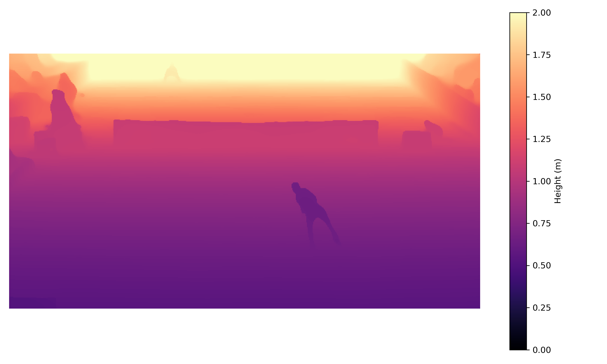

# Оценка облака точек теннисного корта с помощью **VGGT**


## Содержание

1. [Зависимости](#зависимости)
2. [Быстрый старт](#быстрый-старт)
3. [Описание скриптов](#описание-скриптов)
4. [Подробный конвейер](#подробный-конвейер)
5. [Сравнение](#Сравнение с оригинальной реализацией)
---

## Зависимости

| Компонент     | Проверенная версия |
| ------------- | ------------------ |
| Python        |  ≥ 3.9             |
| PyTorch       |  2.1 (CUDA 11.8)   |
| OpenCV‑Python |  4.9               |
| Plotly        |  5.x               |

### 1  Клонируем VGGT и ставим зависимости

```bash
git clone https://github.com/facebookresearch/vggt
cd vggt
pip install -r requirements.txt
```

### 2  Скачиваем веса модели

```bash
wget -O vggt-1b.pt "https://huggingface.co/facebook/vggt/resolve/main/vggt-1b.pt"
```

---

## Быстрый старт

```bash
# 1. Извлекаем RGB+XYZ для каждого кадра
python run_vggt.py --video data/tennis.mp4 --weights vggt-1b.pt --device cuda

# 2. Кликаем четыре угла корта
python manual_point_picker.py      # сохранит pts_img.json

# 3. Строим гомографию (пиксели → метры)
python compute_homography.py       # сохранит H.npy

# 4. Формируем финальный тензор (RGB, высота, X, Y)
python make_tensor.py              # tensor_court.pt

# 5. 3‑D‑проверка
python plotly_visualize.py --frame 0
```

Все промежуточные файлы сохраняются в текущей директории; имена можно менять через параметры CLI.

---

## Описание скриптов

| Скрипт                       | Назначение                                                        | Ключевые параметры                   | Выходной файл      |
| ---------------------------- | ----------------------------------------------------------------- | ------------------------------------ | ------------------ |
| **run\_vggt.py**             | Прогон VGGT; выдаёт `(T, 6, H, W)` — RGB + XYZ в системе камеры   | `--resize`, `--batch_size`, `rgbxyz_tensor.pt` |
| **manual\_point\_picker.py** | Ручной выбор четырёх углов корта                                  | —                                    | `pts_img.json`     |
| **compute\_homography.py**   | Гомография пиксели → метры по выбранным точкам                    | —                                    | `H.npy`            |
| **make\_tensor.py**          | Перевод camera‑Z в истинную высоту над кортом, добавление `(X,Y)` | `--rgbxyz`, `--hmat`, `--out`        | `tensor_court.pt`  |
| **plotly\_visualize.py**     | Интерактивное 3‑D‑облако для любого кадра                         | `--frame`                            | —                  |

---

## Подробный конвейер

### 1  `run_vggt.py` — извлечение RGB + XYZ

```bash
python run_vggt.py \
    --video videos/serve.mp4 \
    --weights vggt-1b.pt \
    --device cuda \
    --resize 672
```

Выход: `rgbxyz_tensor.pt` *(T, 6, H, W)* и `frame_proc.png` — первый кадр после предобработки.

### Пример кадра с глубиной

также можно визуально проверить, как выглядит карта глубины (высоты над кортом) из `rgbxyz_tensor.pt`.
Вот пример:

<p align="center">
  
</p>


### 2  `manual_point_picker.py` — выбор углов

После получения `rgbd_tensor.pt` разметим 4 ключевые точки теннисного корта (углы) на одном из кадров. Это нужно для вычисления гомографии — перехода от изображения к координатам корта в метрах.

<p align="center">
  
</p>

---

### 3  `compute_homography.py` — пиксели → координаты корта

Создаёт `H.npy` (3×3). Используются физические координаты:

```
X — вдоль длины корта (23.77 м)
Y — вдоль ширины одиночного корта (8.23 м)
```

### Визуализация гомографии

Вот пример применении гомографии:

<p align="center">
  
</p>

### 4  `make_tensor.py` — финальный тензор

Шаги:

1. **Оценка плоскости:** По первому кадру оценивается плоскость корта, на которую далее проецируются все точки: `z = a + by + d`.
2. **Высота:** Для каждой точки вычисляем ортогональное расстояние до плоскости.
3. **Проекция:** Гомография переводит каждый пиксель в `(X_court, Y_court)` (метры).
4. **Склейка:** `[R,G,B, height, X, Y] → tensor_court.pt` *(T,H,W,6)*.

### 5  `plotly_visualize.py` — быстрая проверка
После прохождения всех шагов мы получаем визуализацию облака точек в системе координат корта. Это результат обработки видео теннисного розыгрыша с помощью модели **VGGT**. (можете попробовать прогнать посмотреть сами)

### Полученная проекция

<p align="center">
  
</p>

# Сравнение с оригинальной реализацией

Если сравнивать с публичной демо-версией от Facebook в [Hugging Face Spaces](https://huggingface.co/spaces/facebook/vggt), видно, что результат аналогичен:

<p align="center">
  
</p>